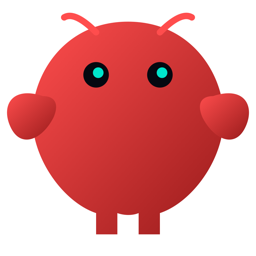
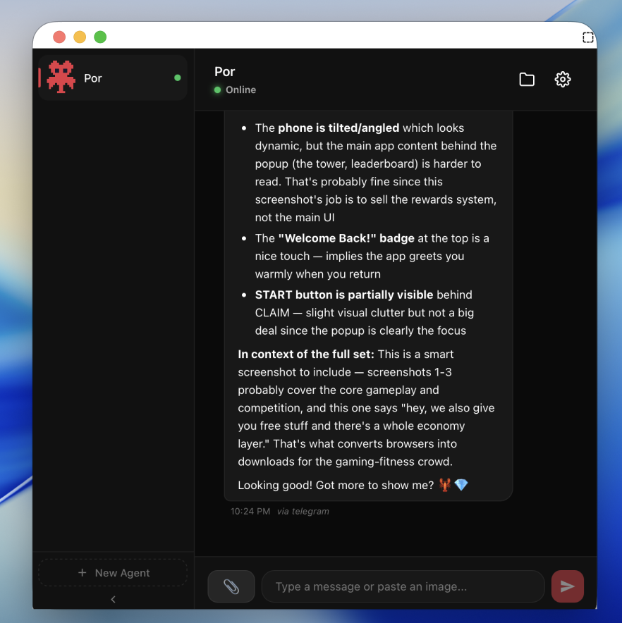
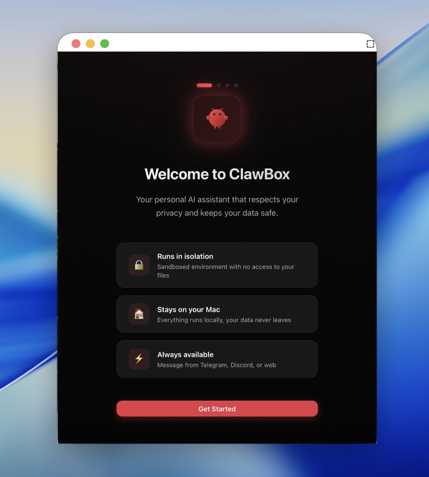
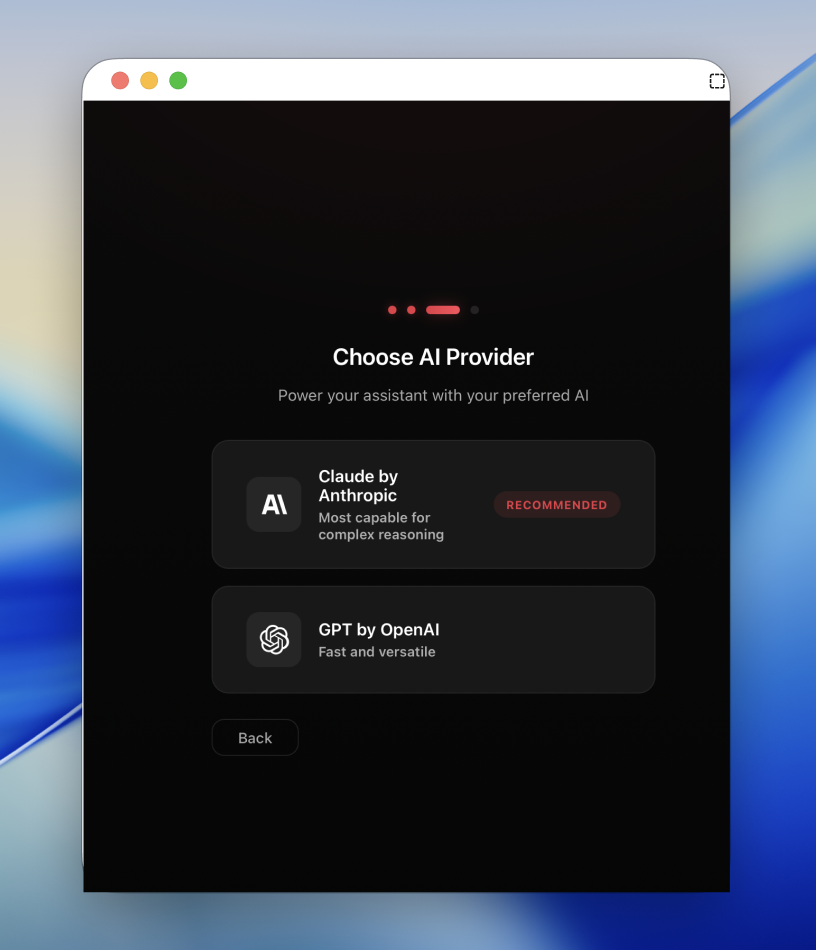
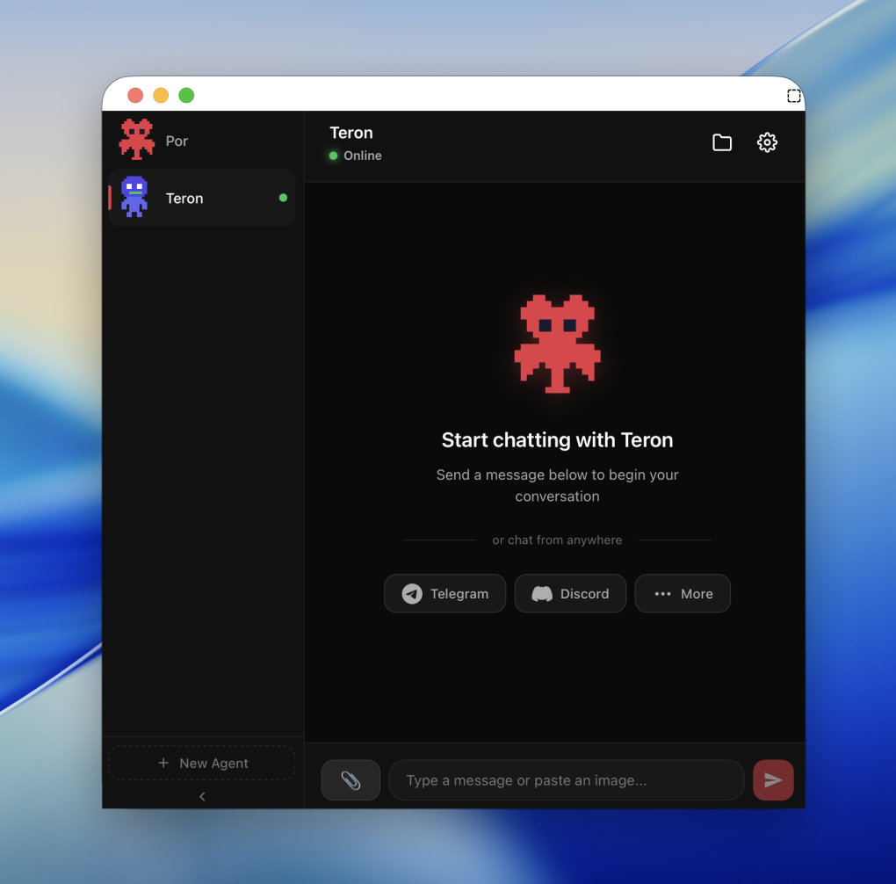

<p align="center">
  
</p>

<h1 align="center">ClawBox</h1>

<p align="center">
  <strong>Your AI assistant, sandboxed and beautiful.</strong>
</p>

<p align="center">
  Run <a href="https://github.com/AiOpenClaw/OpenClaw">OpenClaw</a> in an isolated VM with a native macOS experience.
</p>

<p align="center">
  <a href="https://github.com/coderkk1992/clawbox/releases"></a>
  <a href="https://github.com/coderkk1992/clawbox/blob/main/LICENSE"></a>
  <a href="https://github.com/coderkk1992/clawbox/stargazers"></a>
</p>

<p align="center">
  
</p>

---

## The Problem

OpenClaw is incredibly powerful—it can browse the web, write code, manage files, and automate tasks. But there's a catch:

- **It runs directly on your machine** with full access to everything
- **It's CLI-only**, which isn't for everyone

## The Solution

ClawBox wraps OpenClaw in a **sandboxed Linux VM** and gives it a **gorgeous native interface**.

Your AI assistant gets the tools it needs. Your system stays protected.

<table>
  <tr>
    <td align="center" width="50%">
      <br>
      <strong>5-Minute Setup</strong><br>
      No terminal. No config files. Just click.
    </td>
    <td align="center" width="50%">
      <br>
      <strong>Bring Your Own API Key</strong><br>
      Claude or GPT—your choice.
    </td>
  </tr>
  <tr>
    <td align="center" width="50%">
      <br>
      <strong>Native Chat Experience</strong><br>
      Markdown, code blocks, file downloads.
    </td>
    <td align="center" width="50%">
      <br>
      <strong>Multiple Personalities</strong><br>
      Create agents for different tasks.
    </td>
  </tr>
</table>

## Features

- **Isolated by default** — OpenClaw runs in a VM, not on your host
- **Native macOS app** — Built with Tauri, feels right at home
- **Drag & drop files** — Share images and documents with your AI
- **Multi-channel** — Connect Telegram, Discord, Slack, and more
- **Multiple agents** — Different personalities for different tasks
- **Menu bar integration** — Always one click away

## Quick Start

### Download

Grab the latest release for your Mac from the [**Releases Page**](https://github.com/coderkk1992/clawbox/releases):

| Chip | Download |
|------|----------|
| Apple Silicon (M1/M2/M3/M4) | [ClawBox_0.1.0_aarch64.dmg](https://github.com/coderkk1992/clawbox/releases/download/v1/ClawBox_0.1.0_aarch64.dmg) |
| Intel | [ClawBox_0.1.0_x64.dmg](https://github.com/coderkk1992/clawbox/releases/download/v1/ClawBox_0.1.0_x64.dmg) |

### Requirements

- macOS 13.0 (Ventura) or later
- 4GB+ RAM to allocate
- 10GB disk space

That's it. No Homebrew. No Xcode. No developer tools.

## Build from Source

```bash
# Clone
git clone https://github.com/coderkk1992/clawbox.git
cd ClawBox

# Install dependencies
pnpm install

# Development
pnpm tauri dev

# Production build
pnpm tauri build
```

**Prerequisites:** Node.js 22+, Rust, pnpm

## How It Works

```
┌────────────────────────────────────────────────┐
│              ClawBox (Tauri + React)           │
│                  Native macOS UI               │
├────────────────────────────────────────────────┤
│                 Lima VM Manager                │
├────────────────────────────────────────────────┤
│              Ubuntu 24.04 VM                   │
│  ┌──────────────────────────────────────────┐  │
│  │              OpenClaw Agent              │  │
│  │   Browser · Terminal · File System       │  │
│  └──────────────────────────────────────────┘  │
└────────────────────────────────────────────────┘
         ▲                           │
         │   Your files stay here    │
         └───────────────────────────┘
```

The VM can't touch your Mac. You share only what you explicitly upload.

## Contributing

We'd love your help! Here's how to get started:

1. **Fork & clone** the repo
2. **Create a branch** for your feature (`git checkout -b feature/awesome`)
3. **Make your changes** and test them
4. **Open a PR** with a clear description

### Ideas Welcome

- Windows/Linux support
- More messaging integrations
- Voice input/output
- Plugin system
- UI themes

Check out the [issues](https://github.com/coderkk1992/clawbox/issues) or open a new one.

## Tech Stack

| Layer | Tech |
|-------|------|
| Desktop Framework | [Tauri 2.0](https://tauri.app) |
| Frontend | React + TypeScript |
| Styling | CSS Variables |
| VM Runtime | [Lima](https://github.com/lima-vm/lima) |
| AI Backend | [OpenClaw](https://github.com/AiOpenClaw/OpenClaw) |

## License

[MIT](LICENSE) — do whatever you want.

---

<p align="center">
  <strong>Built with obsessive attention to detail.</strong><br>
  <sub>If you like ClawBox, star the repo. It helps more than you think.</sub>
</p>
